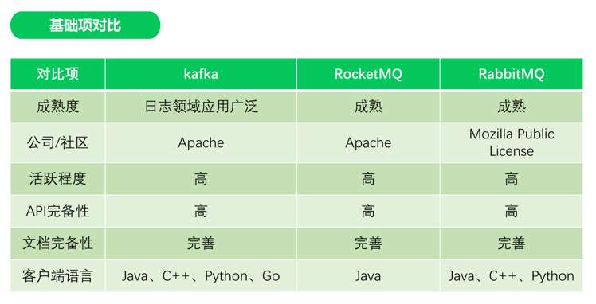
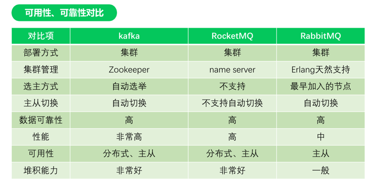
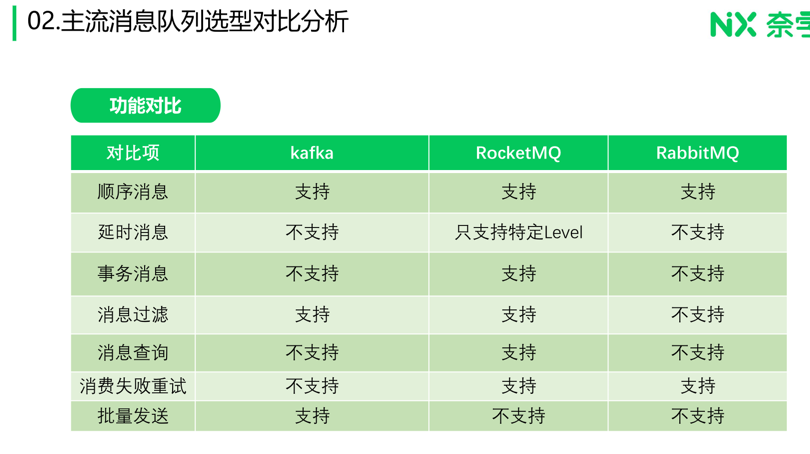

# rabbitmq的消息发送机制
1. 事务模式，会确保消息发送成功，但是效率比较慢。
2. confirm机制，会给消息发送一个唯一id，写入rabbitmq之后会返回一个ack，就ok了，是一个异步的机制。

# 消费端丢失消息
关闭自动ack机制，也就是消费成功之后，才丢弃这条消息，否则继续消费。

# 使用rabbitmq的场景
1. 服务间异步通信 
2. 顺序消费 
3. 定时任务 
4. 请求削峰

# rabbitmq 的问题
1. 复杂性增加
2. 数据一致性问题
3. 可用性降低

# heartbeat如果设置过低的话，可能会在短暂的网络拥塞情况下， 导致误报。
如果将心跳时间设置的过低，会在短暂的网络拥塞或流量控制的清下下导致误报。在选择超时时间时，这也应该作为一个考虑因素。

从用户反馈的多年的经验值及客户端的maintainer的建议来看，低于5s都容易发生误报。对于大多数环境5s到20s之间是最佳的。

# 为什么选择rabbitmq？
1. 是一个成熟
2. 稳定
3. 并发毕竟好
4. 基本不丢数据

# rabbitmq如何保证有序消费

# 你用过kafka没有？？知道原理不？

# rabbitmq和rocketmq的区别？

1. 上下游解耦，下游不需要知道上游的地址。

这种情况下，网关只需要消息分发就好了。

不关心消息结果，或者异步执行时间很长，可以使用mq

二，mq如何做到消息必达。

消息落地
超时，重传，确认。

如何保证幂等

等幂，需要接收方和mq配合来使用的。

mq如何做到，削峰填谷的呢？

mq client  可以批量拉

mq 如何做到消息延时。

